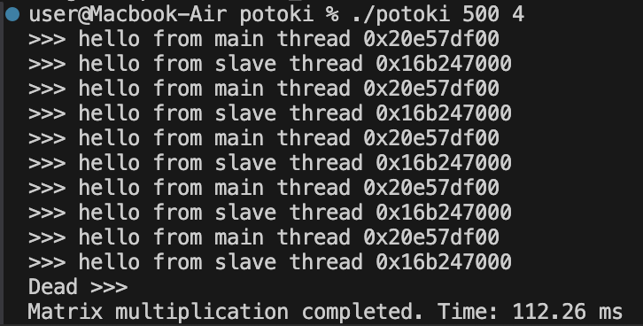
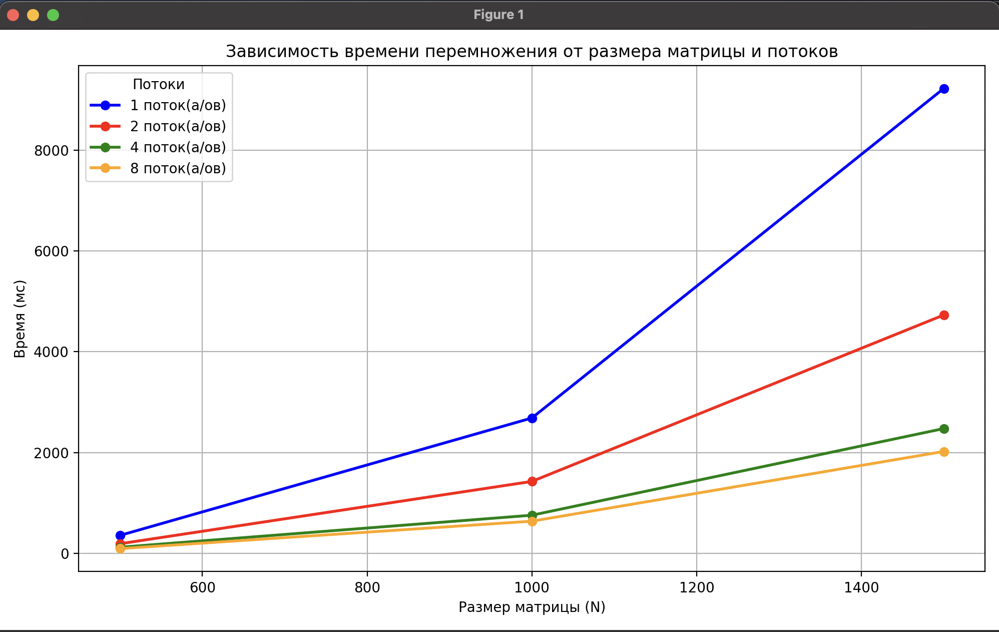

# Лабораторная работа №7

## Тема: Работа с POSIX потоками

**ФИО:** [Кузеванов Юрий Сергеевич]  
**Группа:** [ИКС-431]  

---

## Цель работы

Выполнить работу на 4. Изучить механизмы создания и управления POSIX потоками в C. Научиться использовать мьютексы, условия и обработку завершения потоков. Реализовать многопоточную сортировку и перемножение матриц.

---

## Выполненные задания и описание реализованного кода

### Создание потока и вывод сообщений

Создан поток с помощью `pthread_create()`, основной и дочерний потоки поочередно выводят по 5 строк с сообщением. Изначально без ожидания, затем добавлено ожидание завершения с помощью `pthread_join()`.

### Потоки с параметрами

Основной поток создает 4 потока и передаёт каждому свою строку. Потоки выводят текст, используя переданные аргументы. Это демонстрирует передачу параметров в `pthread`.

### Прерывание дочерних потоков

Каждый поток делает `sleep()` между строками. Через 2 секунды основной поток вызывает `pthread_cancel()` для завершения всех потоков.

### Обработка завершения потоков

Перед завершением каждый поток печатает сообщение `Dead ...`, используя `pthread_cleanup_push()`. Это демонстрирует корректное завершение и освобождение ресурсов.

### Синхронизированный вывод

С помощью `pthread_mutex_t` и `pthread_cond_t` реализована строго чередующаяся печать между основным и дочерним потоком. Используется переменная `turn` для контроля очередности.

### Алгоритм SleepSort

Для каждого числа создается поток. Поток "спит" (`usleep`) на время, соответствующее числу, затем выводит его. В результате числа выводятся в отсортированном порядке.

### Перемножение матриц NxN с потоками

- Матрицы A и B заполняются единицами.
- Используются `N` и `num_threads`, переданные из командной строки.
- Каждый поток обрабатывает диапазон строк матрицы C.
- Используется структура `ThreadData` для передачи аргументов.
- Измеряется время выполнения с помощью `clock_gettime()`.

---

## Анализ

На основании экспериментов был построен график зависимости времени перемножения квадратных матриц от их размера и количества потоков:

Как видно из графика, увеличение количества потоков существенно сокращает время выполнения, особенно на больших матрицах. Это демонстрирует эффективность параллельной обработки и масштабируемость решения.

---

## Вывод

В лабораторной работе были реализованы основные механизмы многопоточности в POSIX:
- создание потоков;
- синхронизация;
- прерывание и завершение;
- сортировка на потоках;
- параллельное перемножение матриц.

Полученные знания применимы в задачах параллельной обработки данных, многозадачности и оптимизации производительности.
